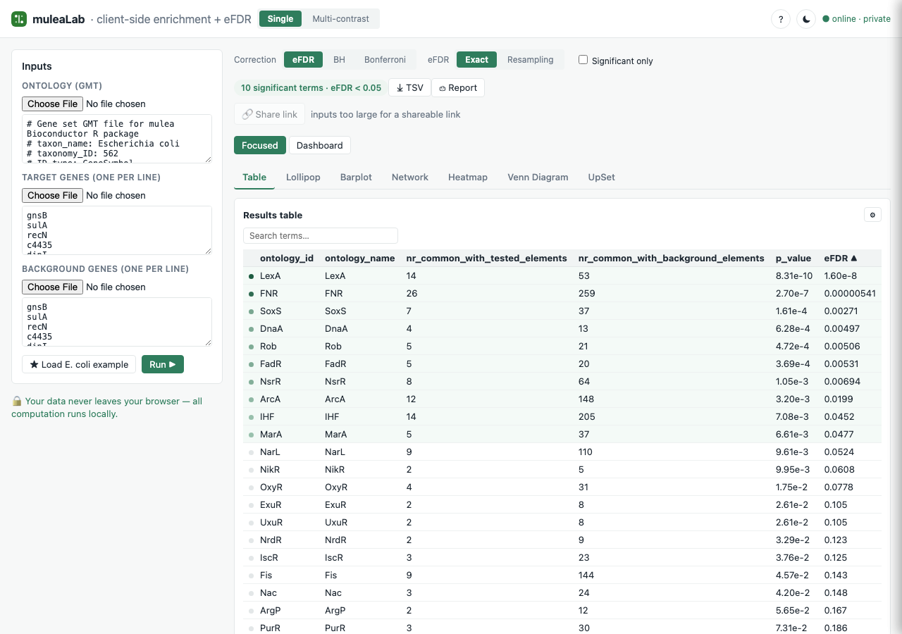
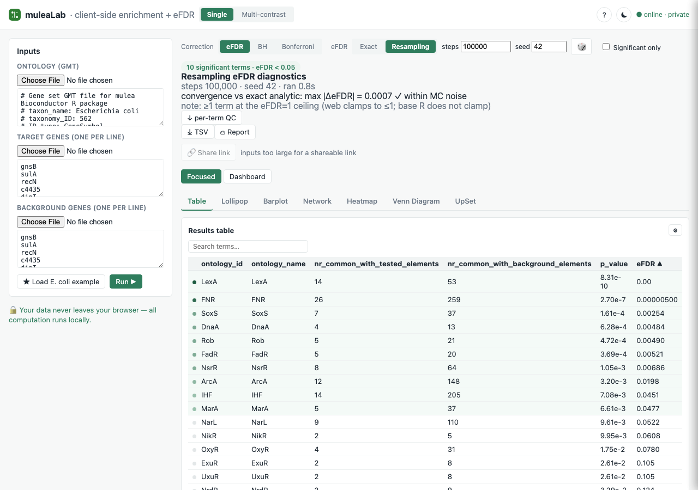
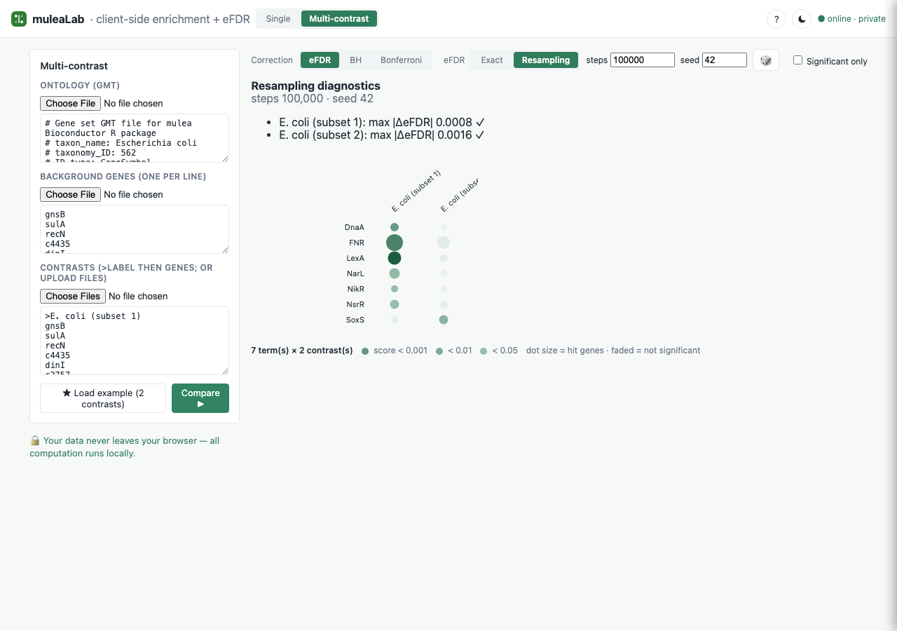
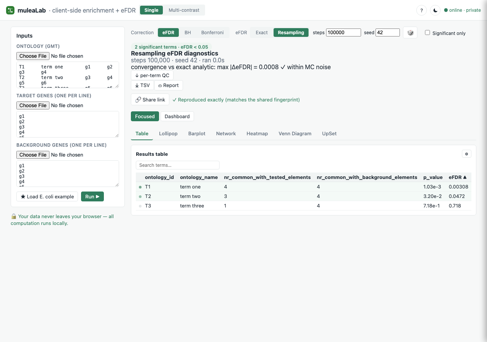

# mulea — web

Client-side enrichment analysis (ORA + exact eFDR) that runs entirely in the browser.
Companion to the [mulea](https://github.com/ELTEbioinformatics/mulea) R package and the
`mulea` Python package; numerically in parity with both.

The app opens on a dark **Deep Lab** landing screen; **Start Analysis** enters the workspace
(dark-teal glass surfaces, a blue→purple→red diverging significance ramp). The ☾/☀ toggle still
switches to the light theme; **← Home** returns to the landing.

## Screenshots

The full eFDR feature, captured in a real browser (Chromium) on the bundled *E. coli* example:

| | |
|---|---|
|  |  |
| **Analytic eFDR** (default) — instant, deterministic. | **Resampling (Monte-Carlo) eFDR** with the convergence diagnostics panel (steps/seed, `max \|ΔeFDR\|` vs exact, per-term QC download) and the 🎲 random-seed control. |
|  |  |
| **Multi-contrast** dot plot with per-contrast resampling convergence diagnostics. | **Reproducible share link** — a resampling result reopened in a fresh browser, reproduced exactly from the captured seed. |

## How it works

mulea finds gene-set categories (ontology terms) that are over-represented in a list of
genes of interest, and corrects for multiple testing — all in the browser. Open the `?` button
in the top bar for the same walkthrough inside the app.

### Inputs
- **Ontology (GMT)** — one term per line: a term ID/name followed by its member genes.
- **Target list** — your genes of interest (e.g. differentially expressed genes).
- **Background list** — the universe of genes the target was drawn from.

The "★ Load E. coli example" button fills all three with a bundled *E. coli* RegulonDB set so you
can try the tool without your own data.

### Methods
Each term is tested for over-representation against the background with the **hypergeometric
test**. You then pick a multiple-testing correction:

- **eFDR** — resampling-based **empirical false discovery rate** (Turek et al. 2024). The
  background is repeatedly resampled to build a null distribution of how often terms reach a
  given p-value by chance; the eFDR is the resampling-estimated rate. It is typically **less
  conservative than BH or Bonferroni**, so it recovers more true terms.
- **BH** — Benjamini–Hochberg FDR.
- **Bonferroni** — most conservative (family-wise error rate).

A term is reported **significant when its score (eFDR or adjusted p-value) is below 0.05**.

### Visualizations
Refined Slate & Pine look: data marks are coloured by a green significance ramp; the top bar and
method/contrast controls use segmented pills; results use underline tabs, a summary pill, and a
significance-dot table.

Switch views with the tabs:

- **Table** — sortable significant-terms table.
- **Lollipop**, **bar** — ranked effect-size / score plots.
- **Network** — term–gene graph (deterministic force layout).
- **Heatmap** — terms × genes overlap.
- **Venn Diagram** / **UpSet** — which terms are called significant under eFDR vs BH vs Bonferroni
  (the paper's comparison, computed on your data).
- **Term drill-down** — click a term/dot to see its hit genes and overlap counts.

Interactive results: search the table by term name, drag network nodes to rearrange the graph, and click any Methods-Venn region to list the terms it contains. Compare the corrections as a Venn diagram or an UpSet plot (set colours adjustable); click any region/intersection to list its terms. Every figure shows its score and is clickable for drill-down; network nodes can be dragged within a visible frame; the heatmap labels its gene columns.

Each figure has a settings panel (the ⚙ button): adjust font, label size, scale, accent/outline
colours, and (for the Methods Venn) transparency — globally or per-figure — plus a title and
element order (by significance, name, or gene overlap); the title is included in the exported
figure. There is also a global colour-blind-safe palette. Export any figure as PNG or SVG (⤓).

### Multi-contrast
Switch to "Multi-contrast" to compare several target lists against one shared ontology +
background on a **dot-plot matrix** (rows = terms, columns = contrasts, dot size = gene overlap,
color = score). Each contrast runs the same eFDR engine as single-contrast mode.

### Reproduce & share
- **Share link** — encodes the full analysis (inputs + method + a result fingerprint) into a URL
  that re-runs deterministically in any browser and verifies the fingerprint matches.
- **Report** — a print-ready PDF (provenance header, significant-terms table, and figures) via
  the browser's print dialog.

### Offline & privacy
After the first visit the app installs as a **PWA** and runs fully offline; **all computation is
client-side** and no data is ever sent to a server. A **light/dark theme** toggle (☾/☀) sits in
the top bar and persists across sessions.

> Method reference: Turek et al., *mulea: an R package for enrichment analysis using multiple
> ontologies and empirical false discovery rate*, **BMC Bioinformatics** 2024, **25**:334.

## Testing

Three tiers, all client-side:

- **Node unit/parity** — `npm test` (Vitest `node` project). Pure-logic tests plus the WASM
  Monte-Carlo eFDR parity (`tests/efdrMc.test.ts`): the WASM engine's eFDR matches the deterministic
  analytic path and the R-generated fixture (`python/tests/fixtures/ora_efdr_reference.csv`) within
  Monte-Carlo tolerance (≤ 0.01). The node tests load the WASM via `wasmBinary`.
- **Browser engine** — `npm run test:browser` (Vitest `browser` project, real headless Chromium via
  the Playwright provider). Runs the WASM engine and the `mcEfdr` Web Worker in a real browser,
  fetching `efdr_core.wasm` via `import.meta.url` (`tests/browser/**`). Requires
  `npx playwright install chromium` once.
- **App e2e** — `npm run test:e2e` (`@playwright/test`, built preview on :4173). Drives the app:
  load example → run → results table; correction-method toggle; every result view's SVG; dashboard +
  drilldown; TSV export; Report; capsule share → replay; multi-contrast; theme/help/settings drawers.

Run everything: `npm run test:all` (node + browser, then e2e) — or the three commands above.

### eFDR modes

The web app offers two eFDR computations under the **eFDR** correction:
- **Exact (analytic)** — deterministic, instant; the n→∞ limit of mulea's resampling (default).
- **Resampling (Monte-Carlo)** — the WASM core running N permutations (default 100000, seed 42, both
  editable). Deterministic given the seed, so results are reproducible and shareable. A diagnostics
  panel reports runtime and the max |ΔeFDR| vs the exact analytic value as a convergence check. The
  chosen mode + steps + seed are recorded in the share capsule, the Report, and the TSV export.

`runAnalysisMc` (the Monte-Carlo path) is covered by node parity tests and by the browser/e2e tier.

Resampling extras: a 🎲 button fills a fresh random seed; a per-term QC table (MC vs exact analytic
eFDR) is downloadable from the diagnostics panel; multi-contrast runs show per-contrast convergence;
a soft hint appears when steps exceed 1,000,000.

### WASM artifacts

The compiled eFDR core lives at `web/src/wasm/efdr_core.{js,wasm}`, committed prebuilt (built from
`src/set-based-enrichment-test.cpp` via `wasm/build-wasm.sh`; Emscripten not required to develop or
build the web app). Note: the production `vite build` does not yet bundle `efdr_core.wasm` because no
shipped UI path imports the Monte-Carlo worker (the UI uses the analytic eFDR); the WASM is exercised
in-browser by the Tier-2 tests. Wiring the MC worker into the UI is a later phase.

## Develop
- `npm install`
- `npm run dev` — local dev server
- `npm test` — Vitest (pure-logic + R-parity tests)
- `npm run build` — static production bundle (`dist/`)
- `npm run preview` — serve the built bundle

## Deploy
Static build, no backend, no environment variables — deploy `dist/` to Vercel (or any static host).
All computation runs client-side in a Web Worker; user data never leaves the browser.

## Layout
- `src/{statistics,io,ontology,ora,efdr}.ts` — the headless compute core (parity-tested)
- `src/analysis.ts`, `src/exportTsv.ts`, `src/lollipop.ts`, `src/tableView.ts` — pure app logic (tested)
- `src/worker/`, `src/hooks/`, `src/ui/`, `src/App.tsx` — the React UI (verified by typecheck + build)
- `public/examples/` — bundled E. coli RegulonDB example

## Visualizations
Visualizations: results table, lollipop, barplot, network (deterministic force layout), and heatmap — plus a per-term drill-down (hit genes + overlap counts) — all rendered client-side from pure, tested layout functions, behind a tab switcher, plus a Methods Venn comparing which terms are significant under eFDR vs BH vs Bonferroni (the paper's Fig 1, computed on your data).

## Shareable link
After a run, the "🔗 Share link" button encodes the full analysis (inputs + method + result fingerprint) into a `#c=…` URL fragment. Opening that URL in any browser re-runs the analysis deterministically (no server, no RNG for ORA/BH/Bonferroni) and verifies an FNV-1a fingerprint of the significant rows, showing "✓ Reproduced exactly (matches the shared fingerprint)" on match. A corrupted or tampered fragment shows "This shared link is invalid." and leaves the app in idle state. Scope: small inputs (the full capsule must fit within ~8 KB of URL); downloadable-file and compression support are deferred.

## PDF report
One click on "⎙ Report" renders a print-ready report — provenance header (method, counts, run timestamp), the significant-terms table, and all five figure panels — that the browser saves as a vector PDF via `window.print()`. No server, no upload; the report is generated entirely from the in-memory result.

## Multi-contrast
Multi-contrast: compare several target gene lists against one shared ontology + background on a dot-plot matrix (rows = significant terms, columns = contrasts, dot size = gene overlap, color = score), with click-to-drill-down — each contrast runs the same exact-eFDR engine, identical to single-contrast mode.

## Offline / PWA
The app installs and runs fully offline as a Progressive Web App. A service worker precaches the entire bundle (including the bundled E. coli example) on first visit, so every subsequent visit — and every analysis — works without a network connection. A status badge in the top bar shows "● online" or "● offline — running locally" and updates in real time. This is the strongest form of the privacy guarantee: after the first load, no data ever reaches any server.
