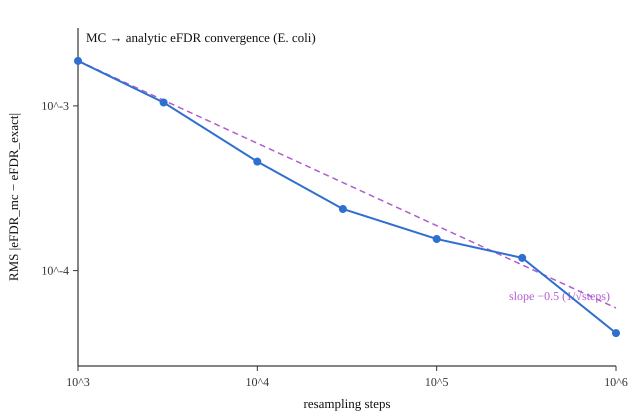

# WASM Monte-Carlo eFDR → analytic eFDR — convergence

> Reproduce: `cd web && node bench/efdr-convergence.mjs > bench/efdr-convergence.md`
> Environment: Node v25.9.0 · Darwin arm64 · Apple M2 Max · median of 5 seeds · E. coli RegulonDB (154 terms)

The analytic eFDR is the deterministic S→∞ limit of mulea's resampling estimator (derivation in
[PARITY.md](../../PARITY.md)). By the CLT the Monte-Carlo error should fall like O(1/√steps) — a
log-log slope of −0.5. Measured against the analytic path on the real E. coli example:

| steps | max&#124;Δ&#124; | RMS&#124;Δ&#124; |
|---:|---:|---:|
| 1,000 | 6.37e-3 | 1.87e-3 |
| 3,000 | 3.54e-3 | 1.05e-3 |
| 10,000 | 1.89e-3 | 4.59e-4 |
| 30,000 | 9.71e-4 | 2.37e-4 |
| 100,000 | 5.18e-4 | 1.56e-4 |
| 300,000 | 4.27e-4 | 1.19e-4 |
| 1,000,000 | 1.52e-4 | 4.18e-5 |

**Fitted log-log slope:** RMS error -0.523, max error -0.519 — both close to the predicted **−0.5**, confirming O(1/√steps) convergence and that the analytic path is the noiseless limit.

